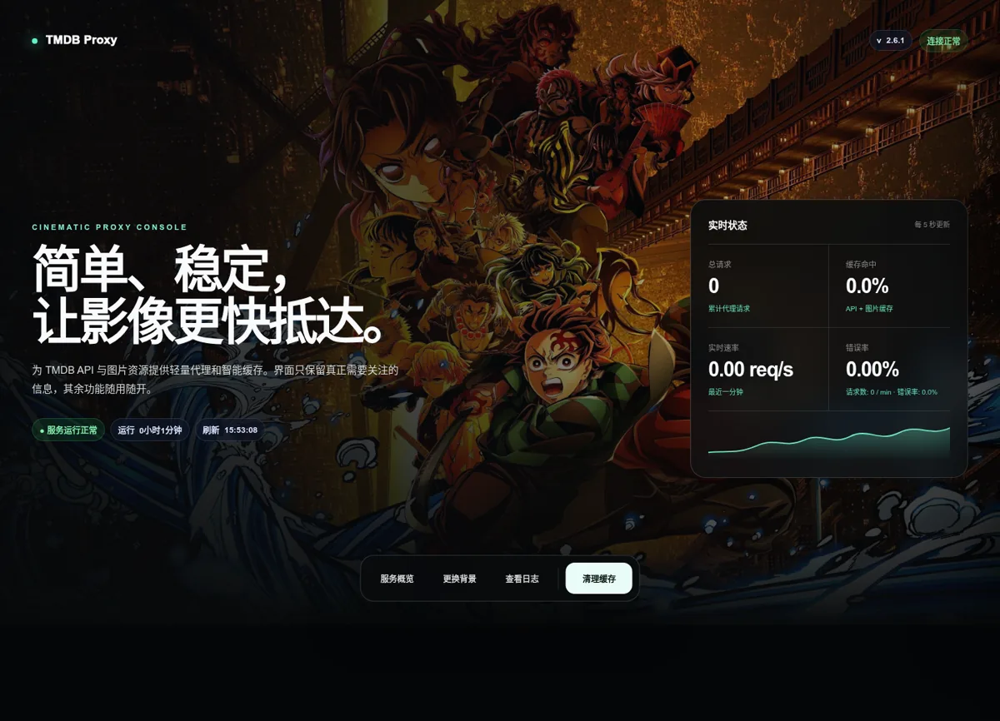
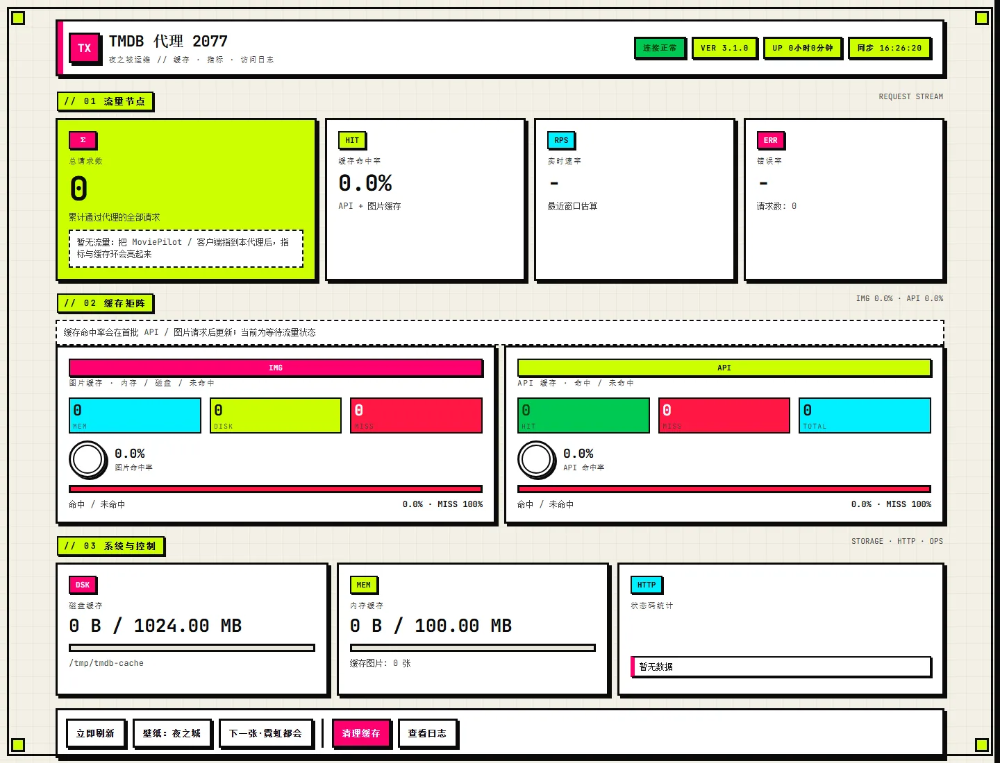
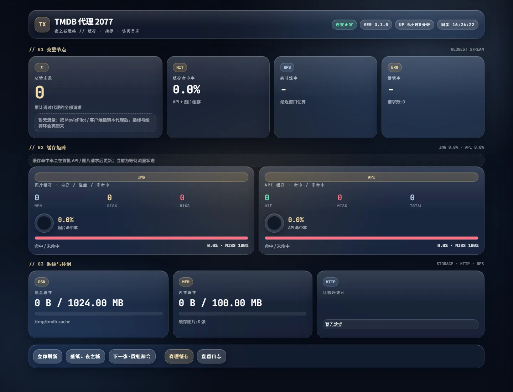
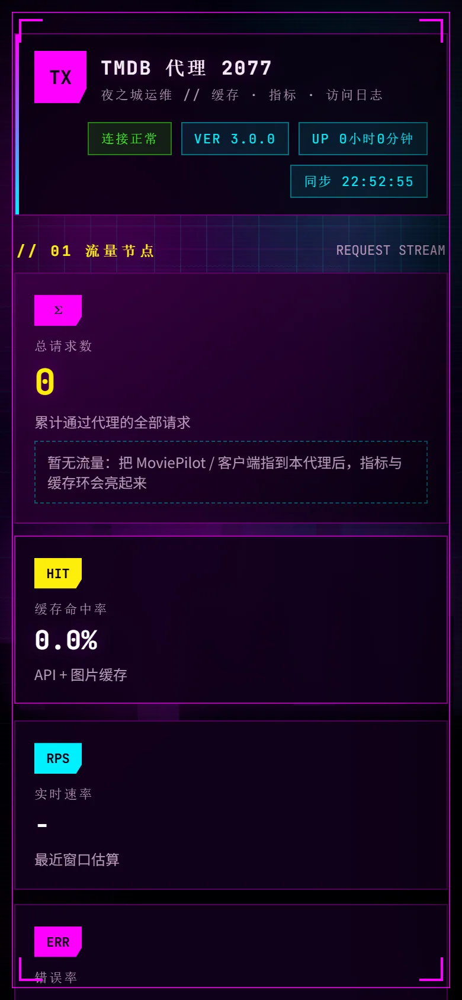
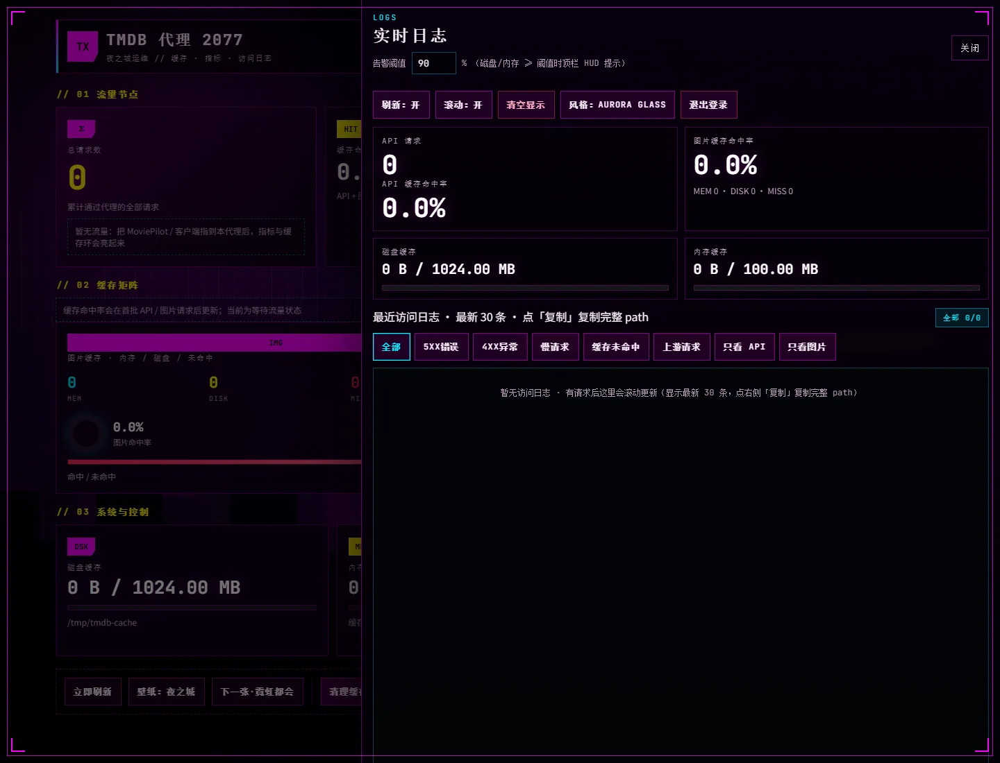

# TMDB Proxy

轻量 **零依赖** TMDB 代理服务，适合自部署给 MoviePilot、媒体库或个人项目使用。

支持：

- TMDB API 代理：`/3/...`
- TMDB 图片代理：`/t/p/...`
- API 缓存、图片内存缓存、图片磁盘缓存
- 管理面板：`/admin/dashboard`（Vue 3，三套可切换主题，单文件 + 本地 vendor）
- Docker / Docker Compose 部署
- `linux/amd64` 和 `linux/arm64` 多架构镜像
- GitHub Actions 自动构建并推送 GHCR 镜像

镜像：

```text
ghcr.io/qqcomeup/tmdb-proxy:latest
```

## 管理面板

登录地址：`/admin/dashboard`，使用环境变量 `ADMIN_API_KEY` 作为管理密钥。

面板能力：

- 运行状态、总请求量、实时 RPS、错误率
- 图片 / API 缓存矩阵（对等双栏：计数 + 环形命中率 + hit/miss 比例条）
- 磁盘 / 内存缓存占用与进度条；占用 ≥ 90% 时在顶栏 HUD 固定告警
- 实时日志抽屉：虚拟列表 + 单条详情（path / status / cache / bytes / upstream）
- 日志轮询支持 `/admin/logs?since=` 增量合并
- 告警阈值默认 90%，可在日志抽屉调整并本地记住
- 窄屏底栏「更多」菜单；零流量空状态提示
- 清理缓存、暂停刷新、主题与壁纸切换

视觉与主题：

- 默认 **Night City（夜之城）** 多层动态城市场景，支持鼠标视差
- 壁纸模式：`夜之城` 自绘动态层 / `TMDB` 随机海报背景（使用 `/t/p/w1280`，避免拉 original）
- 内置三套可切换风格（日志抽屉「风格」按钮循环切换，本地记住）：
  - `Night City`：夜之城霓虹运维（默认）
  - `Neo Brutal`：新野兽派（粗黑边、硬阴影、直角）
  - `Glass Nocturne`：夜航玻璃拟态（深墨毛玻璃 + 香槟金强调）
- Vue 3、本地字体（JetBrains Mono）从容器内 `/admin/vendor/*` 提供，内网/离线更稳
- 遵循 `prefers-reduced-motion`，减弱动画

截图示例（v3.1 管理面板，空白统计仅展示布局）：

### 桌面端总览（Night City 默认）



### 主题对比

**Neo Brutal**



**Glass Nocturne**



### 手机端



### 实时日志抽屉



> 背景可为夜之城动态层或 TMDB 随机背景，实际显示会变化。截图不包含真实密钥、Cookie 或访问日志。主题可在日志抽屉「风格」中切换。

### 本机访问注意

- 请通过服务地址打开，例如 `http://127.0.0.1:54321/admin/dashboard`
- **不要**用浏览器直接打开本地 `admin-dashboard.html`（`file://`），否则 vendor / 接口路径会失效
- 改完面板后一般只需硬刷新（Ctrl+F5）；修改 `server.js` 或环境变量需要重启进程

## 快速开始

新建目录：

```bash
mkdir -p tmdb-proxy
cd tmdb-proxy
```

新建 `docker-compose.yml`：

```yaml
services:
  tmdb-proxy:
    image: ghcr.io/qqcomeup/tmdb-proxy:latest
    container_name: tmdb-proxy
    restart: unless-stopped
    ports:
      - "127.0.0.1:54321:54321"
    environment:
      - TMDB_API_KEY=你的_TMDB_API_KEY
      - ADMIN_API_KEY=你的管理密码
      - COOKIE_SECURE=true
    volumes:
      - tmdb-cache:/tmp/tmdb-cache

volumes:
  tmdb-cache:
```

启动：

```bash
docker compose up -d
```

访问：

```text
http://127.0.0.1:54321/health
http://127.0.0.1:54321/admin/dashboard
```

普通部署只需要填写两个变量：

- `TMDB_API_KEY`
- `ADMIN_API_KEY`

缓存容量、内存缓存、超时、重试、响应大小限制都有内置默认值，不需要写进 Compose。

## 反向代理

默认只绑定本机：

```yaml
ports:
  - "127.0.0.1:54321:54321"
```

推荐通过 Nginx、Caddy、Traefik 等反向代理对外提供 HTTPS。

HTTPS 反代时建议加：

```yaml
environment:
  - TMDB_API_KEY=你的_TMDB_API_KEY
  - ADMIN_API_KEY=你的管理密码
  - IMAGE_DISK_CACHE_DIR=/tmp/tmdb-cache
  - COOKIE_SECURE=true
```

如果还希望访问日志和限流使用真实客户端 IP，而不是反向代理 IP，再加：

```yaml
  - TRUST_PROXY=true
```

仅在服务只接受可信反向代理转发时开启 `TRUST_PROXY`；直接公网暴露时保持默认 `false`。

Nginx 示例头：

```nginx
proxy_set_header Host $host;
proxy_set_header X-Real-IP $remote_addr;
proxy_set_header X-Forwarded-For $proxy_add_x_forwarded_for;
proxy_set_header X-Forwarded-Proto $scheme;
```

## 使用仓库 Compose + .env

也可以直接使用仓库自带 Compose：

```bash
git clone https://github.com/qqcomeup/tmdb-proxy.git
cd tmdb-proxy
cp .env.example .env
```

编辑 `.env`，至少填写：

```env
TMDB_API_KEY=你的_TMDB_API_KEY
ADMIN_API_KEY=你的管理密码
```

仓库 Compose 默认按 HTTPS 反代部署，`.env.example` 已设置 `COOKIE_SECURE=true`。如果只是本机 HTTP 测试，可改成 `false`。

启动：

```bash
docker compose --env-file .env up -d
```

## 常用接口

```text
/health
/ping
/admin/dashboard
/admin/vendor/vue.global.prod.js
/3/movie/popular?api_key=你的_TMDB_API_KEY&language=zh-CN
/t/p/w500/图片路径
```

说明：

- 管理接口需携带有效管理会话或 `X-Admin-Key`（面板登录后自动处理）
- 未授权访问部分管理 API 会返回 404，避免暴露管理端点存在性
- 日志中的 `api_key` 等敏感查询参数会被脱敏

## 默认值

这些默认值已经内置，通常不需要配置：

| 项目 | 默认值 |
| --- | --- |
| 容器内监听端口 | `54321` |
| Compose 对外发布端口，容器内固定监听 `54321` | `54321` |
| 图片磁盘缓存 | `1 GB` |
| 图片内存缓存 | `100 MB` |
| API 缓存条目 | `2000` |
| API 缓存内存估算 | `50 MB` |
| API 缓存 TTL | `600 秒` |
| 图片缓存 TTL | `7 天` |
| API 单次响应上限 | `5 MB` |
| 图片单次响应上限 | `20 MB` |
| TMDB 请求超时 | `15000 ms` |
| API 请求重试 | `2 次` |
| 图片请求重试 | `1 次` |

需要调整时再参考 `.env.example`。

## 更新

```bash
docker compose pull
docker compose up -d
```

## 本地源码运行和测试

```bash
npm start
npm run check
npm test
npm run validate:release
```

发布前请确认：

- 未把真实 `TMDB_API_KEY` / `ADMIN_API_KEY` 写进仓库
- Compose 使用环境变量注入密钥
- 管理面板相关契约测试（`npm test`）通过
